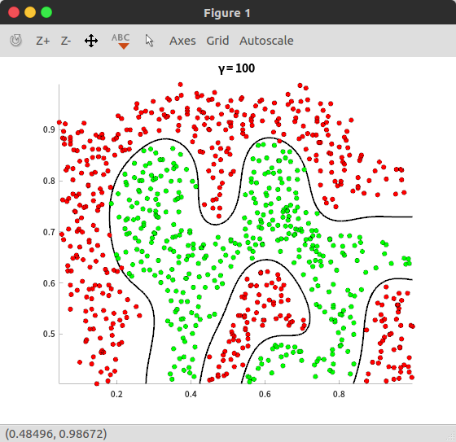

## 线性SVM分类器

- 首先在matlab中切换到`libsvm-3.22/matlab`目录下，执行`make`

- 再将数据集`ex7Data.zip`解压后放到`libsvm-3.22/matlab`目录下

  > 目录结构如下：
  >
  > ```bash
  > libsvm-3.22
  > ├── matlab # 里面包含matlab要用的svm库文件
  > │   ├── ex7Data # 数据集
  > │   │   ├── email_test.txt
  > │   │   ├── email_train-100.txt
  > │   │   ├── email_train-400.txt
  > │   │   ├── email_train-50.txt
  > │   │   ├── email_train-all.txt
  > │   │   └── twofeature.txt
  > │   ├── svmtrain.c
  > │   ├── svmtrain.mex
  > │   └── ...# 很多库文件
  > └── ... # 其他平台的库文件
  > ```


### 实验代码

```matlab
% SVM Email text classification
clear all ; close all ; clc
% Load training features and labels
[ train_y , train_x ] = libsvmread ( 'ex7Data/email_train-50.txt' );
% Train the model and get the primal variables w, b from the model
% Libsvm options
% -t 0 : linear kernel
% Leave other options as their defaults
% model = svmtrain(train_y, train_x, '-t 0');
% w = model.SVs' * model.sv_coef;
% b = -model.rho;
% if (model.Label(1) == -1)
% w = -w; b = -b;
% end
model = svmtrain ( train_y , train_x , sprintf ( '-s 0 -t 0' ));
% Load testing features and labels
[ test_y , test_x ] = libsvmread ( 'ex7Data/email_test.txt' );
[ predicted_label , accuracy , decision_values ] = svmpredict ( test_y , test_x , model );
% After running svmpredict, the accuracy should be printed to the matlab
% console
```


### 运行结果

```matlab
>> [ train_y , train_x ] = libsvmread ( 'ex7Data/email_train-50.txt' );
>> model = svmtrain ( train_y , train_x , sprintf ( '-s 0 -t 0' ));
.*
optimization finished, #iter = 83
nu = 0.004760
obj = -0.118993, rho = 0.750695
nSV = 33, nBSV = 0
Total nSV = 33
>> [ test_y , test_x ] = libsvmread ( 'ex7Data/email_test.txt' );
>> [ predicted_label , accuracy , decision_values ] = svmpredict ( test_y , test_x , model );
Accuracy = 75.3846% (196/260) (classification)
>>
```


## 非线性SVM分类器

> 使用高斯核函数

- 首先将数据集`ex8Data.zip`解压后放到`libsvm-3.22/matlab`目录下
- 再将`libsvm-3.22/matlab/ex8Data`文件夹中的`plotboundary.m`移动到他的上一层目录，因为待会儿要用这个文件画图

>  目录结构如下：
>
>  ```bash
>  libsvm-3.22
>  ├── matlab
>  │   ├── ex7Data
>  │   │   ├── email_test.txt
>  │   │   ├── email_train-100.txt
>  │   │   ├── email_train-400.txt
>  │   │   ├── email_train-50.txt
>  │   │   ├── email_train-all.txt
>  │   │   └── twofeature.txt
>  │   ├── ex8Data # 这次试验要用的数据集
>  │   │   ├── ex8a.txt
>  │   │   └── ex8b.txt
>  │   ├── plotboundary.m # 画图脚本
>  │   └── ... # 其他文件
>  └── ... # 其他文件
>  ```


### 实验代码

```matlab
% ex8a.txt ============================================================
% Load training features and labels
[y, x] = libsvmread('ex8Data/ex8a.txt');
gamma = 100;

% Libsvm options
% -s 0 : classification
% -t 2 : RBF kernel
% -g : gamma in the RBF kernel
model = svmtrain(y, x, sprintf('-s 0 -t 2 -g %g', gamma));

% Display training accuracy
[predicted_label, accuracy, decision_values] = svmpredict(y, x, model);

% Plot training data and decision boundary
plotboundary(y, x, model);
title(sprintf('\\gamma = %g', gamma), 'FontSize', 14);

% ex8b.txt ============================================================
% Load training features and labels
[y, x] = libsvmread('ex8Data/ex8b.txt');
gamma = 100;

% Libsvm options
% -s 0 : classification
% -t 2 : RBF kernel
% -g : gamma in the RBF kernel
model = svmtrain(y, x, sprintf('-s 0 -t 2 -g %g', gamma));

% Display training accuracy
[predicted_label, accuracy, decision_values] = svmpredict(y, x, model);

% Plot training data and decision boundary
plotboundary(y, x, model);
title(sprintf('\\gamma = %g', gamma), 'FontSize', 14);

```


### 运行结果

```matlab
*
optimization finished, #iter = 344
nu = 0.150603
obj = -83.411415, rho = -0.202927
nSV = 157, nBSV = 107
Total nSV = 157
Accuracy = 99.7683% (861/863) (classification)
.*..*
optimization finished, #iter = 682
nu = 0.348952
obj = -51.283399, rho = -0.003248
nSV = 128, nBSV = 38
Total nSV = 128
Accuracy = 94.3128% (199/211) (classification)
```




## Iris 数据集

- 先写一个脚本把sklearn中的iris数据集转换成`libsvm库`所要求的格式

```python
# -*- coding: utf-8 -*-
# @File 	: convert_iris.py
# @Author 	: jianhuChen
# @Date 	: 2019-01-06 11:16:30
# @License 	: Copyright(C), USTC
# @Last Modified by  : jianhuChen
# @Last Modified time: 2019-01-06 11:41:47

import random
from sklearn import datasets

def main():
	# 得到数据集
	iris = datasets.load_iris()
	iris_feature, iris_target = iris.data, iris.target
	# print(iris_target)
	
	fo_train = open("iris_data_train.txt", 'w')
	fo_test = open("iris_data_test.txt", 'w')

	for i in range(len(iris_feature)):
		target = iris_target[i]
		feature = ''
		for j in range( len(iris_feature[0])):
			feature += str(j+1) + ':' + str(iris_feature[i][j]) + ' '
		line = str(target) + ' ' +feature[:-1] + '\n'
		if random.randint(0, 10) < 3:
			fo_test.write(line)
		else:
			fo_train.write(line)

	fo_train.close()
	fo_test.close()

if __name__ == '__main__':
	main()
```

> 上面的脚本会生成两个文件：
>
> 训练集：iris_data_train.txt
>
> 测试集：iris_data_test.txt
>
> 内容格式如下：
>
> ```python
> 0 1:5.0 2:3.6 3:1.4 4:0.2
> 0 1:4.6 2:3.4 3:1.4 4:0.3
> 0 1:4.4 2:2.9 3:1.4 4:0.2
> ......
> ```
>
>

- 再到`matlab`里面调用`libsvm库`来做分类

  因为这个数据集的每个样本特征有4维，所以不太好画图，就把画图的代码注释起来了


### 实验代码

```matlab
function svm_iris()
  
% Load training features and labels
[ train_y , train_x ] = libsvmread ( 'iris_data_train.txt' );

gamma = 1;

% Libsvm options
% -s 0 : classification
% -t 2 : RBF kernel
% -g : gamma in the RBF kernel
model = svmtrain(train_y, train_x, sprintf('-s 0 -t 2 -g %g', gamma));

% Load testing features and labels
[ test_y , test_x ] = libsvmread ( 'iris_data_test.txt' );

% Display training accuracy
[predicted_label, accuracy, decision_values] = svmpredict(test_y, test_x, model);

% Plot training data and decision boundary
% plotboundary(y, x, model);
% title(sprintf('\\gamma = %g', gamma), 'FontSize', 14);
% =======================================================================

% Load training features and labels
[ train_y , train_x ] = libsvmread ( 'iris_data_train.txt' );

% Train the model and get the primal variables w, b from the model
% Libsvm options
% -t 0 : linear kernel
% Leave other options as their defaults
% model = svmtrain(train_y, train_x, '-t 0');
% w = model.SVs' * model.sv_coef;
% b = -model.rho;
% if (model.Label(1) == -1)
% w = -w; b = -b;
% end
model = svmtrain ( train_y , train_x , sprintf ( '-s 0 -t 0' ));

% Load testing features and labels
[ test_y , test_x ] = libsvmread ( 'iris_data_test.txt' );
[ predicted_label , accuracy , decision_values ] = svmpredict ( test_y , test_x , model );

% After running svmpredict, the accuracy should be printed to the matlab
% console
```


### 运行结果

```matlab
optimization finished, #iter = 49
nu = 0.254090
obj = -12.600064, rho = 0.185561
nSV = 26, nBSV = 12
Total nSV = 39
Accuracy = 95.6522% (44/46) (classification)

optimization finished, #iter = 34
nu = 0.215099
obj = -11.514963, rho = -6.677212
nSV = 18, nBSV = 14
Total nSV = 21
Accuracy = 100% (46/46) (classification)
```

> 调整参数 gamma=1 正确率会提高


